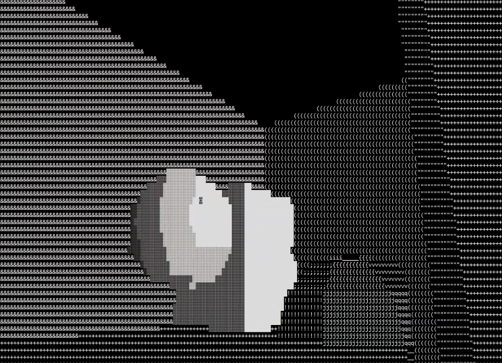

# Ascii Engine

You can find progress videos [here](https://www.youtube.com/playlist?list=PL2MgvFjiDRU94Foe_T3lzJhXe58NM6bgx).

If you are attempting to build this program, make sure you run the exe as admin (VERY IMPORTANT!!!).
Since Windows updated their console api, some functions may not work otherwise (it will also be quite slow).

The SPEC file is a format I made to define project specifications. I have yet to standardize the system.
Hopefully I will have a parser finished soon.

The compiler command can be found in "compile.bat". If you wish to compile by hand,
make sure you include "include" with -I, and link to libgdi32.

UIGen was meant to be used for generating ui structures from an HTMLesque format,
but unfortunately I don't think it will be finished on time.
